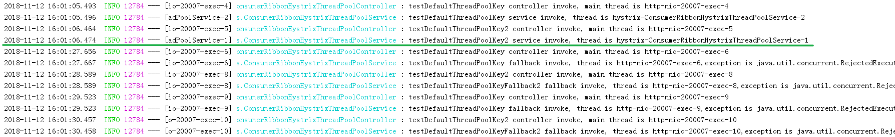
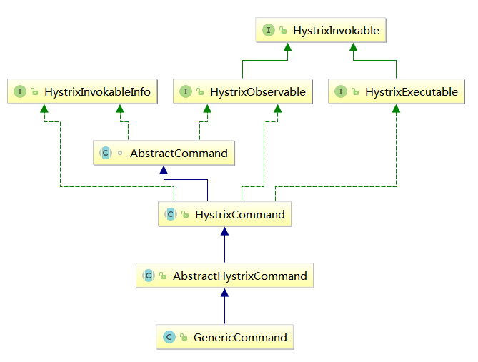

# spring-cloud-example-consumer-ribbon-hystrix-threadpool

## 一、HystrixCommand的threadPoolKey默认值

### 测试端点及方式

http://127.0.0.1:20006/testDefaultThreadPoolKey

http://127.0.0.1:20006/testDefaultThreadPoolKey2

线程池大小设置为2，且不使用队列暂存，服务提供方sleep，通过chrome多窗口调用 */testDefaultThreadPoolKey* 端点

或同时调用 */testDefaultThreadPoolKey*、*/testDefaultThreadPoolKey2* 端点
通过大于线程池最大值的请求被线程池拒绝进入fallback，判断线程池是方法级，还是类级的，以及threadPoolKey默认值

> **注意：**
>
> 使用firefox浏览器测试有问题，多标签页必须等待一个GET请求完成，才能继续下一个，测不出并发的效果。
>
> 一开始以为是程序上的限制，后来才发现是浏览器，使用chrome问题解决


### 配置

```properties
hystrix.threadpool.default.coreSize = 2
hystrix.threadpool.default.maximumSize = 2
hystrix.threadpool.default.maxQueueSize = -1
```

线程池的`coreSize `和`maximumSize `都设置为2（1.5.9版本后才添加`maximumSize `），且线程池队列大小为-1，即使用SynchronousQueue

[Hystrix Thread Pool Properties](https://github.com/Netflix/Hystrix/wiki/Configuration#ThreadPool)


### 测试结果



chrome浏览器连续GET请求调用6次，分别调用3次 */testDefaultThreadPoolKey*，3次 */testDefaultThreadPoolKey2*，以绿色线问分隔，可见前两次调用成功，后4次均直接拒绝，进入fallback

具体异常信息为：

> java.util.concurrent.RejectedExecutionException: Task java.util.concurrent.FutureTask@6d72dcf rejected from java.util.concurrent.ThreadPoolExecutor@431bfebc[Running, pool size = 2, active threads = 2, queued tasks = 0, completed tasks = 1]

线程池大小为2起到了作用，将大于并发数的请求拒绝了，并且无论是只调用 */testDefaultThreadPoolKey*，还是轮询调用 */testDefaultThreadPoolKey* 和 */testDefaultThreadPoolKey2* ，再根据hystrix线程的名字 **hystrix-ConsumerRibbonHystrixThreadPoolService-n**，可以猜想：Hystrix的 threadPoolKey是和command执行的类相关的，可能整个类使用一个线程池


### 原理分析

首先，被@HystrixCommand注解标注的方法会被AOP拦截，具体逻辑在 **`HystrixCommandAspect`**

```java
private static final Map<HystrixPointcutType, MetaHolderFactory> META_HOLDER_FACTORY_MAP;

// 初始化用于处理 HystrixCommand 和 HystrixCollapser 的 MetaHolderFactory
// HystrixCommand -- CommandMetaHolderFactory
// HystrixCollapser -- CollapserMetaHolderFactory
static {
    META_HOLDER_FACTORY_MAP = ImmutableMap.<HystrixPointcutType, MetaHolderFactory>builder()
            .put(HystrixPointcutType.COMMAND, new CommandMetaHolderFactory())
            .put(HystrixPointcutType.COLLAPSER, new CollapserMetaHolderFactory())
            .build();
}


// HystrixCommand Pointcut切入点
@Pointcut("@annotation(com.netflix.hystrix.contrib.javanica.annotation.HystrixCommand)")
public void hystrixCommandAnnotationPointcut() {
}

// HystrixCollapser Pointcut切入点
@Pointcut("@annotation(com.netflix.hystrix.contrib.javanica.annotation.HystrixCollapser)")
public void hystrixCollapserAnnotationPointcut() {
}

// HystrixCommand 和 HystrixCollapser 的环绕通知
@Around("hystrixCommandAnnotationPointcut() || hystrixCollapserAnnotationPointcut()")
public Object methodsAnnotatedWithHystrixCommand(final ProceedingJoinPoint joinPoint) throws Throwable {
    Method method = getMethodFromTarget(joinPoint);
    Validate.notNull(method, "failed to get method from joinPoint: %s", joinPoint);
    if (method.isAnnotationPresent(HystrixCommand.class) && method.isAnnotationPresent(HystrixCollapser.class)) {
        throw new IllegalStateException("method cannot be annotated with HystrixCommand and HystrixCollapser " +
                "annotations at the same time");
    }
    
    // 创建metaHolder，用于保存元数据
    MetaHolderFactory metaHolderFactory = META_HOLDER_FACTORY_MAP.get(HystrixPointcutType.of(method));
    MetaHolder metaHolder = metaHolderFactory.create(joinPoint);
    
    // 创建HystrixCommand，HystrixInvokable是父接口
    HystrixInvokable invokable = HystrixCommandFactory.getInstance().create(metaHolder);
    ExecutionType executionType = metaHolder.isCollapserAnnotationPresent() ?
            metaHolder.getCollapserExecutionType() : metaHolder.getExecutionType();

    // 执行HystrixCommand
    Object result;
    try {
        if (!metaHolder.isObservable()) {
            result = CommandExecutor.execute(invokable, executionType, metaHolder);
        } else {
            result = executeObservable(invokable, executionType, metaHolder);
        }
    } catch (HystrixBadRequestException e) {
        throw e.getCause() != null ? e.getCause() : e;
    } catch (HystrixRuntimeException e) {
        throw hystrixRuntimeExceptionToThrowable(metaHolder, e);
    }
    return result;
}
```

其中`MetaHolder metaHolder = metaHolderFactory.create(joinPoint);`根据joinPoint的信息创建元数据时肯定会有**默认groupKey**、**默认commandKey**以及**默认threadPoolKey**的逻辑

```java
private static class CommandMetaHolderFactory extends MetaHolderFactory {
    @Override
    public MetaHolder create(Object proxy, Method method, Object obj, Object[] args, final ProceedingJoinPoint joinPoint) {
        HystrixCommand hystrixCommand = method.getAnnotation(HystrixCommand.class);
        ExecutionType executionType = ExecutionType.getExecutionType(method.getReturnType());
        
        // 创建MetaHolderBuilder
        MetaHolder.Builder builder = metaHolderBuilder(proxy, method, obj, args, joinPoint);
        if (isCompileWeaving()) {
            builder.ajcMethod(getAjcMethodFromTarget(joinPoint));
        }
        
        return builder.defaultCommandKey(method.getName())  //默认commandKey是方法名
                        .hystrixCommand(hystrixCommand)
                        .observableExecutionMode(hystrixCommand.observableExecutionMode())
                        .executionType(executionType)
                        .observable(ExecutionType.OBSERVABLE == executionType)
                        .build();
    }
}


//----------再来看看创建MetaHolderBuilder - metaHolderBuilder()
//== MetaHolderFactory#metaHolderBuilder()
MetaHolder.Builder metaHolderBuilder(Object proxy, Method method, Object obj, Object[] args, final ProceedingJoinPoint joinPoint) {
    MetaHolder.Builder builder = MetaHolder.builder()
            .args(args).method(method).obj(obj).proxyObj(proxy)
            .joinPoint(joinPoint);

    // 设置fallback方法
    setFallbackMethod(builder, obj.getClass(), method);
    // 设置默认配置
    builder = setDefaultProperties(builder, obj.getClass(), joinPoint);
    
    return builder;
}

//== setDefaultProperties()
private static MetaHolder.Builder setDefaultProperties(MetaHolder.Builder builder, Class<?> declaringClass, final ProceedingJoinPoint joinPoint) {
    //根据@DefaultProperties注解获取配置
    Optional<DefaultProperties> defaultPropertiesOpt = AopUtils.getAnnotation(joinPoint, DefaultProperties.class);
    //设置 默认groupKey为类名simpleName
    builder.defaultGroupKey(declaringClass.getSimpleName());
    
    //如果存在@DefaultProperties，使用其指定的groupKey、threadPoolKey
    if (defaultPropertiesOpt.isPresent()) {
        DefaultProperties defaultProperties = defaultPropertiesOpt.get();
        builder.defaultProperties(defaultProperties);
        if (StringUtils.isNotBlank(defaultProperties.groupKey())) {
            builder.defaultGroupKey(defaultProperties.groupKey());
        }
        if (StringUtils.isNotBlank(defaultProperties.threadPoolKey())) {
            builder.defaultThreadPoolKey(defaultProperties.threadPoolKey());
        }
    }
    return builder;
}
```


**由此可见，在构造metaHolder元数据时，通过类名作为goutpKey，通过方法名作为commandKey，但没有指定threadPoolKey**


但执行HystrixCommand时是有默认threadPoolKey的，那么这个默认值从何而来，command又是怎么初始化线程池的呢？？

可以查看通过metaHolder构造HystrixCommand的过程：

```java
//----------HystrixCommandFactory#create()
public HystrixInvokable create(MetaHolder metaHolder) {
    HystrixInvokable executable;
    if (metaHolder.isCollapserAnnotationPresent()) {
        executable = new CommandCollapser(metaHolder);
    } else if (metaHolder.isObservable()) {
        executable = new GenericObservableCommand(HystrixCommandBuilderFactory.getInstance().create(metaHolder));
    } else {
        //通过metaHolder构造HystrixCommandBuilder，再创建GenericCommand
        executable = new GenericCommand(HystrixCommandBuilderFactory.getInstance().create(metaHolder));
    }
    return executable;
}


//----------HystrixCommandBuilderFactory#create()
//在创建HystrixCommandBuilder时，createGenericSetterBuilder(metaHolder)构造了Setter，是用于设置groupKey、commandKey、threadPoolKey的
public <ResponseType> HystrixCommandBuilder create(MetaHolder metaHolder, Collection<HystrixCollapser.CollapsedRequest<ResponseType, Object>> collapsedRequests) {
    validateMetaHolder(metaHolder);

    return HystrixCommandBuilder.builder()
            .setterBuilder(createGenericSetterBuilder(metaHolder))
            .commandActions(createCommandActions(metaHolder))
            .collapsedRequests(collapsedRequests)
            .cacheResultInvocationContext(createCacheResultInvocationContext(metaHolder))
            .cacheRemoveInvocationContext(createCacheRemoveInvocationContext(metaHolder))
            .ignoreExceptions(metaHolder.getCommandIgnoreExceptions())
            .executionType(metaHolder.getExecutionType())
            .build();
}

//----------createGenericSetterBuilder()  创建Setter
private GenericSetterBuilder createGenericSetterBuilder(MetaHolder metaHolder) {
    GenericSetterBuilder.Builder setterBuilder = GenericSetterBuilder.builder()
            .groupKey(metaHolder.getCommandGroupKey())
            .threadPoolKey(metaHolder.getThreadPoolKey()) //查看从metaHolder如何获取threadPoolKey
            .commandKey(metaHolder.getCommandKey())
            .collapserKey(metaHolder.getCollapserKey())
            .commandProperties(metaHolder.getCommandProperties())
            .threadPoolProperties(metaHolder.getThreadPoolProperties())
            .collapserProperties(metaHolder.getCollapserProperties());
    if (metaHolder.isCollapserAnnotationPresent()) {
        setterBuilder.scope(metaHolder.getHystrixCollapser().scope());
    }
    return setterBuilder.build();
}

//如果使用了Command注解，从注解指定的threadPoolKey 和 defaultThreadPoolKey二选一，以前者为主
//本例中，既没有通过注解指定threadPoolKey，也没有defaultThreadPoolKey
public String getThreadPoolKey() {
    return isCommandAnnotationPresent() ? get(hystrixCommand.threadPoolKey(), defaultThreadPoolKey) : "";
}
```

从上面看，在HystrixCommandBuilder构造完成，都没有设置threadPoolKey

下面是通过`HystrixCommandBuilder`作为参数`new GenericCommand()`，即通过`HystrixCommandBuilder`创建`HystrixCommand`

**GenericCommand**的类图为：



向上进入父类构造，HystrixCommand(Setter setter)

```java
protected HystrixCommand(Setter setter) {
    // use 'null' to specify use the default
    this(setter.groupKey, setter.commandKey, setter.threadPoolKey, null, null, setter.commandPropertiesDefaults, setter.threadPoolPropertiesDefaults, null, null, null, null, null);
}
```

从setter中获取了groupKey、commandKey、threadPoolKey、commandPropertiesDefaults、threadPoolPropertiesDefaults，其它参数为null

进入到 **AbstractCommand构造方法**，封装了构造一个HystrixCommand的基本上所有元素的逻辑

```java
protected AbstractCommand(HystrixCommandGroupKey group, HystrixCommandKey key, HystrixThreadPoolKey threadPoolKey, HystrixCircuitBreaker circuitBreaker, HystrixThreadPool threadPool,
        HystrixCommandProperties.Setter commandPropertiesDefaults, HystrixThreadPoolProperties.Setter threadPoolPropertiesDefaults,
        HystrixCommandMetrics metrics, TryableSemaphore fallbackSemaphore, TryableSemaphore executionSemaphore,
        HystrixPropertiesStrategy propertiesStrategy, HystrixCommandExecutionHook executionHook) {

    this.commandGroup = initGroupKey(group); //初始化commandGroupKey
    this.commandKey = initCommandKey(key, getClass()); //初始化commandKey
    this.properties = initCommandProperties(this.commandKey, propertiesStrategy, commandPropertiesDefaults); //初始化commandProperties
    this.threadPoolKey = initThreadPoolKey(threadPoolKey, this.commandGroup, this.properties.executionIsolationThreadPoolKeyOverride().get()); //初始化threadPoolKey
    this.metrics = initMetrics(metrics, this.commandGroup, this.threadPoolKey, this.commandKey, this.properties); //初始化metrics
    this.circuitBreaker = initCircuitBreaker(this.properties.circuitBreakerEnabled().get(), circuitBreaker, this.commandGroup, this.commandKey, this.properties, this.metrics); //初始化断路器
    this.threadPool = initThreadPool(threadPool, this.threadPoolKey, threadPoolPropertiesDefaults); //初始化线程池

    //Strategies from plugins
    this.eventNotifier = HystrixPlugins.getInstance().getEventNotifier();
    this.concurrencyStrategy = HystrixPlugins.getInstance().getConcurrencyStrategy();
    HystrixMetricsPublisherFactory.createOrRetrievePublisherForCommand(this.commandKey, this.commandGroup, this.metrics, this.circuitBreaker, this.properties);
    this.executionHook = initExecutionHook(executionHook);

    this.requestCache = HystrixRequestCache.getInstance(this.commandKey, this.concurrencyStrategy);
    this.currentRequestLog = initRequestLog(this.properties.requestLogEnabled().get(), this.concurrencyStrategy);

    /* fallback semaphore override if applicable */
    this.fallbackSemaphoreOverride = fallbackSemaphore;

    /* execution semaphore override if applicable */
    this.executionSemaphoreOverride = executionSemaphore;
}
```


接下来主要看是如何初始化threadPoolKey，以及threadPool的

**initThreadPoolKey(threadPoolKey, this.commandGroup, this.properties.executionIsolationThreadPoolKeyOverride().get())**

参数：

- threadPoolKey  --  指定的 或 默认的threadPoolKey 

- this.commandGroup  --  当前的groupKey

- this.properties.executionIsolationThreadPoolKeyOverride().get())  --  字符串类型，允许动态覆盖修改HystrixThreadPoolKey的值，并将动态更新HystrixCommand执行的HystrixThreadPool，这个override值的典型值是null，并且在构造HystrixCommandProperties时override全局的配置为null

  ```java
  // threadpool doesn't have a global override, only instance level makes sense
  this.executionIsolationThreadPoolKeyOverride = forString().add(propertyPrefix + ".command." + key.name() + ".threadPoolKeyOverride", null).build();
  ```

接着看 **initThreadPoolKey()**

```java
/*
 * ThreadPoolKey
 *
 * This defines which thread-pool this command should run on.
 *
 * It uses the HystrixThreadPoolKey if provided, then defaults to use HystrixCommandGroup.
 * 如果提供了threadPoolKey，就使用，否则默认使用groupKey
 * It can then be overridden by a property if defined so it can be changed at runtime.
 * 可以被threadPoolKeyOverride在运行时动态覆盖
 */
private static HystrixThreadPoolKey initThreadPoolKey(HystrixThreadPoolKey threadPoolKey, HystrixCommandGroupKey groupKey, String threadPoolKeyOverride) {
    if (threadPoolKeyOverride == null) {
        // we don't have a property overriding the value so use either HystrixThreadPoolKey or HystrixCommandGroup
        if (threadPoolKey == null) {
            /* use HystrixCommandGroup if HystrixThreadPoolKey is null */
            return HystrixThreadPoolKey.Factory.asKey(groupKey.name());
        } else {
            return threadPoolKey;
        }
    } else {
        // we have a property defining the thread-pool so use it instead
        return HystrixThreadPoolKey.Factory.asKey(threadPoolKeyOverride);
    }
}
```

可见，在最开始构造HystrixCommand时，threadPoolKeyOverride为null，且没有自己自定threadPoolKey，也没有默认的threadPoolKey，那么将使用groupKey作为threadPoolKey

**所以，默认使用groupKey作为threadPoolKey，而group默认值是类名**


最后，看一下如何根据threadPoolKey，初始化threadPool

**AbstractCommand#initThreadPool()**

```java
//----------AbstractCommand#initThreadPool()
private static HystrixThreadPool initThreadPool(HystrixThreadPool fromConstructor, HystrixThreadPoolKey threadPoolKey, HystrixThreadPoolProperties.Setter threadPoolPropertiesDefaults) {
    // fromConstructor为null，使用HystrixThreadPool.Factory创建线程池
    if (fromConstructor == null) {
        // get the default implementation of HystrixThreadPool
        return HystrixThreadPool.Factory.getInstance(threadPoolKey, threadPoolPropertiesDefaults);
    } else {
        return fromConstructor;
    }
}


//----------HystrixThreadPool.Factory#getInstance()
static HystrixThreadPool getInstance(HystrixThreadPoolKey threadPoolKey, HystrixThreadPoolProperties.Setter propertiesBuilder) {
    // get the key to use instead of using the object itself so that if people forget to implement equals/hashcode things will still work
    String key = threadPoolKey.name();

    // this should find it for all but the first time
    HystrixThreadPool previouslyCached = threadPools.get(key);
    if (previouslyCached != null) {
        return previouslyCached;
    }

    // if we get here this is the first time so we need to initialize
    synchronized (HystrixThreadPool.class) {
        if (!threadPools.containsKey(key)) {
            threadPools.put(key, new HystrixThreadPoolDefault(threadPoolKey, propertiesBuilder));
        }
    }
    return threadPools.get(key);
}
```

先根据threadPoolKey尝试从threadPools这个`ConcurrentHashMap<String, HystrixThreadPool>`中获取，即从线程池缓存中获取，有就直接返回previouslyCached之前的缓存，如果没有，synchromized对HystrixThreadPool类上锁后，再次判断还是没有threadPoolKey的缓存，就 `new HystrixThreadPoolDefault(threadPoolKey, propertiesBuilder)`

```java
public HystrixThreadPoolDefault(HystrixThreadPoolKey threadPoolKey, HystrixThreadPoolProperties.Setter propertiesDefaults) {
    this.properties = HystrixPropertiesFactory.getThreadPoolProperties(threadPoolKey, propertiesDefaults); //threadPoolProperties
    HystrixConcurrencyStrategy concurrencyStrategy = HystrixPlugins.getInstance().getConcurrencyStrategy(); //并发策略
    this.queueSize = properties.maxQueueSize().get(); //线程池队列大小

    //创建HystrixThreadPoolMetrics，其中concurrencyStrategy.getThreadPool()会创建线程池
    this.metrics = HystrixThreadPoolMetrics.getInstance(threadPoolKey,
            concurrencyStrategy.getThreadPool(threadPoolKey, properties),
            properties);
    this.threadPool = this.metrics.getThreadPool();
    this.queue = this.threadPool.getQueue();

    /* strategy: HystrixMetricsPublisherThreadPool */
    HystrixMetricsPublisherFactory.createOrRetrievePublisherForThreadPool(threadPoolKey, this.metrics, this.properties);
}


//----------HystrixConcurrencyStrategy#getThreadPool(HystrixThreadPoolKey, HystrixThreadPoolProperties)
public ThreadPoolExecutor getThreadPool(final HystrixThreadPoolKey threadPoolKey, HystrixThreadPoolProperties threadPoolProperties) {
    final ThreadFactory threadFactory = getThreadFactory(threadPoolKey);

    final boolean allowMaximumSizeToDivergeFromCoreSize = threadPoolProperties.getAllowMaximumSizeToDivergeFromCoreSize().get(); //是否允许maximumSize生效
    final int dynamicCoreSize = threadPoolProperties.coreSize().get(); //动态coreSize
    final int keepAliveTime = threadPoolProperties.keepAliveTimeMinutes().get(); //大于coreSize的线程，未使用的保活时间
    final int maxQueueSize = threadPoolProperties.maxQueueSize().get(); //线程队列最大值
    final BlockingQueue<Runnable> workQueue = getBlockingQueue(maxQueueSize);

    //允许使用maximumSize
    if (allowMaximumSizeToDivergeFromCoreSize) {
        final int dynamicMaximumSize = threadPoolProperties.maximumSize().get();
        
        //dynamicCoreSize > dynamicMaximumSize，打印error
        if (dynamicCoreSize > dynamicMaximumSize) {
            logger.error("Hystrix ThreadPool configuration at startup for : " + threadPoolKey.name() + " is trying to set coreSize = " +
                    dynamicCoreSize + " and maximumSize = " + dynamicMaximumSize + ".  Maximum size will be set to " +
                    dynamicCoreSize + ", the coreSize value, since it must be equal to or greater than the coreSize value");
            return new ThreadPoolExecutor(dynamicCoreSize, dynamicCoreSize, keepAliveTime, TimeUnit.MINUTES, workQueue, threadFactory);
        } 
        //dynamicCoreSize <= dynamicMaximumSize，正常
        else { 
            return new ThreadPoolExecutor(dynamicCoreSize, dynamicMaximumSize, keepAliveTime, TimeUnit.MINUTES, workQueue, threadFactory);
        }
    } 
    else { //不允许使用maximumSize
        return new ThreadPoolExecutor(dynamicCoreSize, dynamicCoreSize, keepAliveTime, TimeUnit.MINUTES, workQueue, threadFactory);
    }
}
```


### 结论

- **threadPoolKey**的默认值是**groupKey**，而**groupKey**默认值是类名

- 可以通过在类上加**@DefaultProperties( threadPoolKey="xxx" )**设置默认的threadPoolKey

- 可以通过**@HystrixCommand( threadPoolKey="xxx" )**指定当前HystrixCommand实例的threadPoolKey

- **threadPoolKey**用于从线程池缓存中获取线程池 和 初始化创建线程池，由于默认以groupKey即类名为threadPoolKey，那么默认所有在一个类中的HystrixCommand共用一个线程池

- **动态配置线程池**  --  可以通过`hystrix.command.HystrixCommandKey.threadPoolKeyOverride=线程池key`动态设置threadPoolKey，对应的线程池也会重新创建，还可以继续通过`hystrix.threadpool.HystrixThreadPoolKey.coreSize=n`和`hystrix.threadpool.HystrixThreadPoolKey.maximumSize=n`动态设置线程池大小

  > 注意： 通过threadPoolKeyOverride动态修改threadPoolKey之后，hystrixCommand会使用新的threadPool，但是老的线程池还会一直存在，并没有触发shutdown的机制


